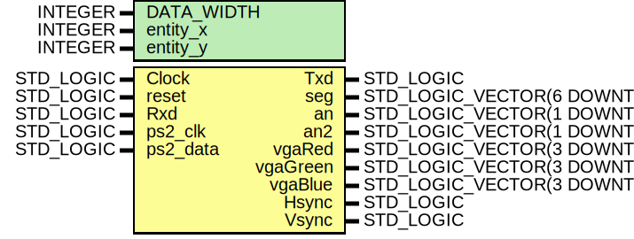

# Entity: top 
- **File**: top.vhd

## Diagram

## Description

Include the IEEE standard logic library
Entity declaration for the top-level design

## Generics

| Generic name | Type    | Value | Description                        |
| ------------ | ------- | ----- | ---------------------------------- |
| DATA_WIDTH   | INTEGER | 128   | Data width for UART and processing |
| entity_x     | INTEGER | 0     | Entity X coordinate (user-defined) |
| entity_y     | INTEGER | 0     | Entity Y coordinate (user-defined) |

## Ports

| Port name | Direction | Type                         | Description                           |
| --------- | --------- | ---------------------------- | ------------------------------------- |
| Clock     | in        | STD_LOGIC                    | System clock                          |
| reset     | in        | STD_LOGIC                    | Synchronous reset                     |
| Txd       | out       | STD_LOGIC                    | UART transmitter output               |
| Rxd       | in        | STD_LOGIC                    | UART receiver input                   |
| seg       | out       | STD_LOGIC_VECTOR(6 DOWNTO 0) | Seven segment display segments        |
| an        | out       | STD_LOGIC_VECTOR(1 DOWNTO 0) | Seven segment anode control (group 1) |
| an2       | out       | STD_LOGIC_VECTOR(1 DOWNTO 0) | Seven segment anode control (group 2) |
| vgaRed    | out       | STD_LOGIC_VECTOR(3 DOWNTO 0) | VGA red output                        |
| vgaGreen  | out       | STD_LOGIC_VECTOR(3 DOWNTO 0) | VGA green output                      |
| vgaBlue   | out       | STD_LOGIC_VECTOR(3 DOWNTO 0) | VGA blue output                       |
| Hsync     | out       | STD_LOGIC                    | VGA horizontal sync                   |
| Vsync     | out       | STD_LOGIC                    | VGA vertical sync                     |
| ps2_clk   | in        | STD_LOGIC                    | PS/2 clock line                       |
| ps2_data  | in        | STD_LOGIC                    | PS/2 data line                        |

## Signals

| Name                            | Type                                       | Description                                |
| ------------------------------- | ------------------------------------------ | ------------------------------------------ |
| uart_tx_data_sig                | STD_LOGIC_VECTOR (DATA_WIDTH - 1 DOWNTO 0) | Data to be transmitted                     |
| uart_tx_enable_sig              | STD_LOGIC                                  | Enable signal for UART TX                  |
| uart_tx_done_sig                | STD_LOGIC                                  | UART TX done flag                          |
| uart_rx_data_sig                | STD_LOGIC_VECTOR (DATA_WIDTH - 1 DOWNTO 0) | Data received                              |
| uart_rx_done_sig                | STD_LOGIC                                  | UART RX done flag                          |
| cu_vga_data_sig                 | STD_LOGIC_VECTOR (111 DOWNTO 0)            | VGA display data                           |
| cu_vga_done_sig                 | STD_LOGIC                                  | VGA data ready flag                        |
| cu_uart_tx_data_sig             | STD_LOGIC_VECTOR (DATA_WIDTH - 1 DOWNTO 0) | Data to transmit from control unit         |
| cu_uart_tx_enable_sig           | STD_LOGIC                                  | UART TX enable from control unit           |
| cu_uart_tx_done_sig             | STD_LOGIC                                  | UART TX done signal to control unit        |
| cu_uart_rx_data_sig             | STD_LOGIC_VECTOR (DATA_WIDTH - 1 DOWNTO 0) | UART received data to control unit         |
| cu_uart_rx_done_sig             | STD_LOGIC                                  | UART RX done signal to control unit        |
| display_flag_done_receiving_sig | STD_LOGIC                                  | Flag indicating data reception is complete |
| display_data_sig                | STD_LOGIC_VECTOR (0 TO 111)                | Data to be displayed                       |
| keyboard_flag_receive_sig       | STD_LOGIC                                  | PS/2 data reception flag                   |
| keyboard_data_out_sig           | STD_LOGIC_VECTOR (0 TO 127)                | Output data from keyboard                  |

## Instantiations

- keyboard_inst: Keyboard
  -  Instantiate Keyboard
- control_unit_inst: control_unit
  -  Instantiate Control Unit
- uart_inst: uart_j
  -  Instantiate UART
- display_inst: Display
  -  Instantiate Display
